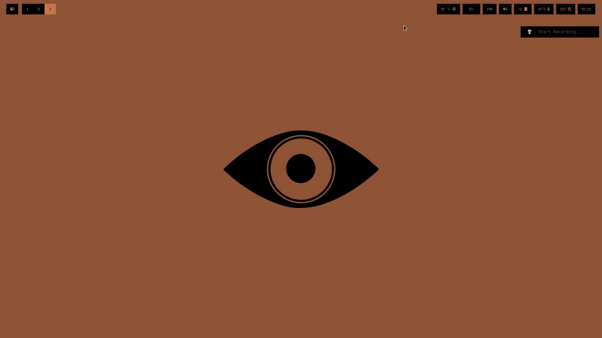

# Observer theme dots

This is my first Sway theme rice for sharing with you. Minimal, fast, ergonomic & brown-orange .. Enjoy autotiling, gaps (super+z) an no gaps windows (super+x) with or without waybar on the second stroke. Easy keyboard shortcuts for screen recording (super+f9 start recording / super+shift+f9 stop recording), super +m for music super+v for random music..etc.. Search on sway config for more keyboard bindings for the scripts. Enjoy!!  

## Instructions

* Put the config folder contents to your .config
* Put the local folder contents to your .local
* Put the home folder contents to your home folder (home/yourusername)
* Execute in terminal the following commands: 
  * sudo chown -R yourusername /home/yourusername
  * chmod +x ~/.local/bin/* 

## Using the following Os and apps:

* Arch Linux
* sway (window manager)
* swayidle
* swaylock
* waybar (info bar)
* autotiling (dynamic tiling)
* dunst (notifier)
* newsboat (cli rss reader)
* flashfocus (flash fx on windows)
* wlsunset (redshift replacement for wayland)
* pulseaudio 
* pulsemixer
* htop
* alacritty (terminal)
* neovim (editor)
* rofi (wayland-version search bar) 
* mpc (cli music app)
* mpd (cli music server)
* ncmpcpp (cli musicplayer)
* mpv (video player)
* youtube-dl (downloader)
* imv (image viewer)
* wf-recorder (screen capturing-recording)
* zathura (reader)
* zathura-pdf-mu-pdf (pdf for zathura)
* fff (cli file manager)
* surfer (minimal web browser) 
* custom scripts included (modified from others)
* custom wallpaper
* terminus (font)
* ttf-awesome-icons (font for icons) 
* zsh 
* zsh-autosuggestions
* zsh-syntax-highlighting

